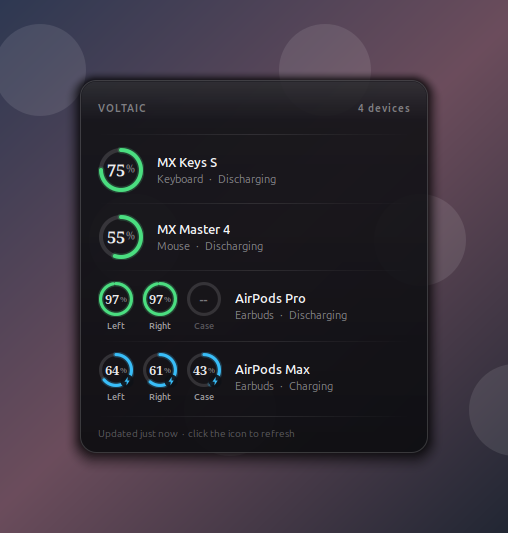

# Voltaic

[](https://github.com/jcfs/voltaic/actions/workflows/ci.yml)
[](LICENSE)

Wireless device battery levels in the Linux system tray — Logitech keyboards
and mice, and AirPods down to each earbud and the case. Hover the icon for a
translucent panel with a gauge per device; click to keep it open.



- **Opens on hover.** The panel appears when the pointer rests on the tray
  icon and closes when it leaves, with a grace period so you can move onto
  the panel itself. A click pins it open.
- **Per-earbud AirPods battery.** Left, right and case separately, via
  Apple's own accessory protocol — not the single blended figure BlueZ
  offers.
- **No dependencies.** Speaks Logitech's HID++ over `/dev/hidraw` and Apple's
  AAP over an L2CAP socket, both using only the Python standard library.
  Solaar is not required and neither is root.
- **Live updates.** Between scans it listens for unsolicited HID++ battery and
  connection notifications, so plugging in a charging cable updates the panel
  straight away instead of waiting out the poll interval.
- **Remembers offline devices.** A keyboard that powers off or switches to
  another host stays in the list, greyed out, with its last known charge —
  rather than silently vanishing.
- **HiDPI aware.** The tray icon is rendered at the panel's real pixel size.

Works with Unifying, Bolt, and Nano receivers, with Logitech devices paired
directly over Bluetooth, and with AirPods and Beats.

Voltaic never connects a Bluetooth device behind your back — it only reads
accessories that are already connected, because bringing up an audio device
unasked would hijack your sound output. Disconnected AirPods keep their last
known levels, marked offline, with a **Connect** button in the panel when you
do want them brought up.

## Install

### Debian, Ubuntu, Mint

Download the `.deb` from the [latest release][releases] and:

```sh
sudo apt install ./voltaic_*_all.deb
```

That is the whole install. The package pulls in the GTK dependencies and
ships the udev rules, and its post-install step replays them against the
receiver you already have plugged in — so there is nothing to configure and
nothing to replug. Then search for **Voltaic** in your launcher.

### Arch, Manjaro

```sh
curl -O https://raw.githubusercontent.com/jcfs/voltaic/main/packaging/PKGBUILD
makepkg -si
```

### Anything else

```sh
curl -fsSL https://raw.githubusercontent.com/jcfs/voltaic/main/install.sh | sh
```

It works out your distribution, shows you exactly what it will run, and asks
before touching anything. Two steps use sudo: installing the GTK packages,
and installing the udev rules. Fedora, openSUSE, Arch and the Debian family
are recognised; pass `-y` to skip the prompt.

### From source

```sh
git clone https://github.com/jcfs/voltaic
cd voltaic

make install-udev     # grant hidraw access (asks for sudo) — do this first
make rebind           # re-enumerate the receiver so the rules apply now
make install          # install for the current user
voltaic               # run it
```

You need GTK 3, PyGObject and pycairo from your distribution first — they do
not come from PyPI, and Voltaic needs no other Python packages at all:

| Distribution | Command |
| --- | --- |
| Debian / Ubuntu / Mint | `sudo apt install python3-gi python3-cairo gir1.2-xapp-1.0` |
| Fedora | `sudo dnf install python3-gobject python3-cairo xapps` |
| Arch / Manjaro | `sudo pacman -S python-gobject python-cairo xapp` |
| openSUSE | `sudo zypper install python3-gobject python3-cairo` |

The XApp package is optional; it is only used as a status-icon backend on
Cinnamon, MATE and Xfce.

`make install` puts Voltaic in a private virtualenv under
`~/.local/share/voltaic/venv` and links it into `~/.local/bin`. The venv is
created with `--system-site-packages` so the distribution's GTK stays
visible inside it; this is also what makes the install work on distributions
that enforce [PEP 668](https://peps.python.org/pep-0668/) — Ubuntu 24.04,
Debian 12 and Fedora 39 among them — where `pip install --user` is refused
outright.

Remove it again with `make uninstall`. Build your own `.deb` with `make deb`.

[releases]: https://github.com/jcfs/voltaic/releases/latest

### Check the setup

```sh
make check
```

```
GTK 3          ok
pycairo        ok
XApp           ok
HID++ node     /dev/hidraw3
```

### About the udev rules

`make install-udev` writes `/etc/udev/rules.d/60-voltaic.rules`, which tags
Logitech hidraw nodes with `uaccess` so the logged-in user can open them. The
rules only apply to devices as they are enumerated, which is why `make rebind`
(or physically replugging the receiver) is needed the first time.

The `60-` prefix matters: systemd adds the ACL from `73-seat-late.rules`,
which matches on the `uaccess` tag, so the tag has to be set by a file that
sorts before it. A higher number leaves the node `root:root 0600` and Voltaic
finds a HID++ node it cannot open — no devices, no error.

## Troubleshooting

**Nothing happens when I launch it.** The GTK stack is missing. Run `voltaic`
from a terminal and it will name the packages to install; launched from a
desktop shortcut it shows the same message in a dialog.

**The panel says "Permission denied on /dev/hidraw…".** The udev rules are
not installed, or they were installed but the receiver has not been
re-enumerated since. Run `make install-udev && make rebind`. Confirm it
worked with `getfacl /dev/hidraw0 | grep $USER`, which should show a
`user:<you>:rw-` line.

**My Logitech devices are missing but the receiver is plugged in.** Check
`make check` reports a HID++ node. If it says none found, the receiver may be
a non-HID++ model. If a node is listed but no devices appear, make sure
Solaar is not running — only one HID++ client can poll a node at a time.

**AirPods do not appear.** They must already be connected; Voltaic will not
bring up an audio device unasked, because that would hijack your sound
output. Use the **Connect** button on the offline row. `voltaic --list` says
explicitly when the Bluetooth stack itself could not be reached.

**The tray icon is missing on GNOME.** GNOME dropped tray icons; you need an
extension such as AppIndicator Support, after which `--tray appindicator`
works. Hover-to-open is unavailable on that backend — see
[Requirements](#requirements).

## Usage

```sh
voltaic                     # run in the tray
voltaic --list              # print levels and exit
voltaic --interval 300      # scan every 5 minutes (default: 900)
voltaic --no-notify         # suppress low-battery notifications
voltaic --tray xapp         # force a particular status-icon backend
```

| Action | Result |
| --- | --- |
| Hover the icon | Panel opens; closes again when the pointer leaves |
| Click the icon | Panel opens and stays open; click again to close |
| Click **Connect** on an offline row | Brings the Bluetooth link up, then refreshes |
| Click elsewhere, or Escape | Closes a pinned panel |
| Right-click the icon | Refresh now, Start at login, Quit |

The Connect button appears only for Bluetooth accessories. A Logitech device
behind a receiver associates itself when you switch it on and cannot be
summoned by the host, so offering a button there would be a lie.

## Does polling drain the batteries?

Not meaningfully, but it is not free either, and the cost is not where you
would guess.

One scan is 25 HID++ requests and 175 bytes — the radio traffic is irrelevant.
What costs something is that pinging a *sleeping* device wakes it. Measured on
a Bolt receiver:

| | Time for a full scan |
| --- | --- |
| Device just polled (awake) | 0.39 s |
| Device idle, cold | 1.02 s |
| Device idle 20 s | 1.87 s |

Almost all of that is waiting for the device to wake, so each scan pulls both
devices out of deep sleep for a second or two. At the 900 s default that is 96
wakes a day per device — a few minutes of extra awake-but-idle time daily,
against devices rated in months. It is small next to actually *using* the
mouse, but for a device you leave untouched for weeks it would be the main
thing keeping it awake.

Nothing is lost by scanning rarely: **opening the panel refreshes it**, so what
you look at is always current. The background scan only feeds the tray icon
and the low-battery warning. Lengthen it further with `--interval` if you have
a device you rarely touch; the only cost is a staler tray icon and a later
low-battery warning.

AirPods are free when they are in the case: discovery is a 30 ms D-Bus query
with no radio traffic whatsoever, and the L2CAP channel is only opened for an
accessory that is already connected — where the link is up regardless.

## Requirements

GTK 3, PyGObject and pycairo, all of which ship with any mainstream desktop.

The status icon has three backends, chosen automatically in this order:

| Backend | Hover | Notes |
| --- | --- | --- |
| `xembed` | yes | Legacy `Gtk.StatusIcon`. The only backend that reports both a hover signal and the icon's screen rectangle, which is what makes hover-to-open possible. |
| `xapp` | no | `XAppStatusIcon`, native to Cinnamon/MATE/Xfce. Gives click coordinates but has no enter/leave signal, so hover falls back to a text tooltip. |
| `appindicator` | no | SNI. No coordinates and no plain left click, so the panel is opened from a menu entry. |

`Gtk.StatusIcon` is deprecated in GTK 3 and gone in GTK 4, which is why the
other two exist — but nothing in the modern tray protocols replaces the two
things it reports, so it stays the preferred backend while it works. Override
with `--tray` if your desktop mishandles XEmbed icons.

See [Install](#1-system-packages) for the package names on each distribution.

## How it works

A receiver exposes one HID++ interface — the hidraw node whose report
descriptor carries the Logitech vendor usage page (`0xFF00`) with report IDs
`0x10` and `0x11`. Voltaic finds that node by parsing report descriptors from
sysfs, so it never writes probe packets at unrelated hardware.

Devices paired to a receiver are addressed as indexes 1–6 on that one node
(a directly-attached device answers on `0xFF` instead). Each index is pinged
via the root feature; whatever answers is then asked for its name
(feature `0x0005`) and battery, preferring `0x1004` UNIFIED_BATTERY for a true
state of charge and falling back to `0x1000` or raw millivolts from `0x1001`.

Two details worth knowing if you touch the protocol code:

- **A sleeping device takes ~400 ms to answer its first ping.** The timeout is
  1.5 s to cover that. Empty pairing slots are cheap regardless — the receiver
  rejects them immediately rather than going quiet.
- **The receiver distinguishes "nothing paired here" from "paired but the
  radio link is down."** HID++ 1.0 error `0x04` means the latter, `0x08`/`0x09`
  the former. That difference is what makes the greyed-out offline entries
  possible.

Because the hidraw node is shared, replies have to be matched to requests: every
frame that doesn't match the device index, feature index, and software id of
the outstanding request is discarded. Only one Voltaic may run at a time — a
second instance would steal the first one's replies — which an abstract unix
socket enforces.

### AirPods

BlueZ exposes at most a single `org.bluez.Battery1` percentage for a headset,
and only with experimental features enabled, so it cannot answer "how full is
the case?". Apple's accessory protocol can. AirPods advertise the vendor
service `74ec2172-0bad-4d01-8f77-997b2be0722a` and listen on L2CAP PSM
`0x1001`; after a fixed handshake and a request for notifications they push a
frame with one entry per cell:

```
04 00 04 00 04 00 03  02 01 63 02 01  04 01 63 02 01  08 01 00 04 01
└─ header ──┘ └count  └ right 99%     └ left 99%      └ case, absent
```

Each entry is `component, ?, level, status, ?`, where component is
`0x02` right, `0x04` left, `0x08` case, and status is `0x01` charging,
`0x02` discharging, `0x04` disconnected. A part that is away reports level
`0`, which is shown as "—" rather than a misleading 0%.

Two things worth knowing:

- **Notifications must be requested or nothing is ever sent.** The handshake
  alone yields a channel that stays silent. Firmware revisions disagree about
  the last byte of the request mask, so both variants are sent; with the right
  one a battery frame arrives in about 0.2 s.
- **The case only reports when it is in play.** With the buds out and the case
  closed it comes back as disconnected, so it is excluded from the "lowest
  level" that drives the tray icon — otherwise wearing your AirPods would peg
  the icon at 0%.

Running Voltaic alongside Solaar works, but both are reading the same node, so
each may occasionally miss a notification the other consumed.

## Layout

| File | Role |
| --- | --- |
| `voltaic/model.py` | Transport-agnostic device, battery and cell types |
| `voltaic/hidpp.py` | HID++ protocol over hidraw; discovery, framing, battery features |
| `voltaic/airpods.py` | Apple AAP over L2CAP; per-earbud and case battery |
| `voltaic/monitor.py` | Background scan thread and notification listener |
| `voltaic/state.py` | Remembers names and levels so offline devices stay useful |
| `voltaic/tray.py` | Status icon backends (hover, geometry) and autostart |
| `voltaic/popup.py` | The translucent panel and the battery gauges |
| `voltaic/icons.py` | Cairo-rendered tray icon, cached per level |
| `voltaic/theme.py` | Shared colours, geometry and cairo helpers |

## Development

```sh
make run       # run from the checkout without installing
make test      # headless unit tests — no display, receiver or GTK needed
make coverage  # the same, under coverage, with a floor
make verify    # tray hover/click behaviour; needs a real desktop
```

93 tests, covering the HID++ transport against a fake hidraw node, the AAP
frame decoder, the voltage curve, the device model, the offline cache, the
colour palette and the rendered tray icon. Coverage of those modules is
**53%**; the GTK layer (`app.py`, `popup.py`, `tray.py`) is at 0% and is
exercised by `make verify` against a live desktop instead, since a tray icon
and a hover panel cannot be meaningfully unit-tested.

The protocol and model layers are standard library only, which is what lets
`make test` run in CI on a machine with no GTK and no hardware. Keep it that
way: an accidental top-level `import gi` in those modules will fail the
build. See [CONTRIBUTING.md](CONTRIBUTING.md).

Regenerate the README images after a UI change with
`python3 packaging/make-screenshot.py` (add `--connect` for the second one).

## Licence

MIT — see [LICENSE](LICENSE).
